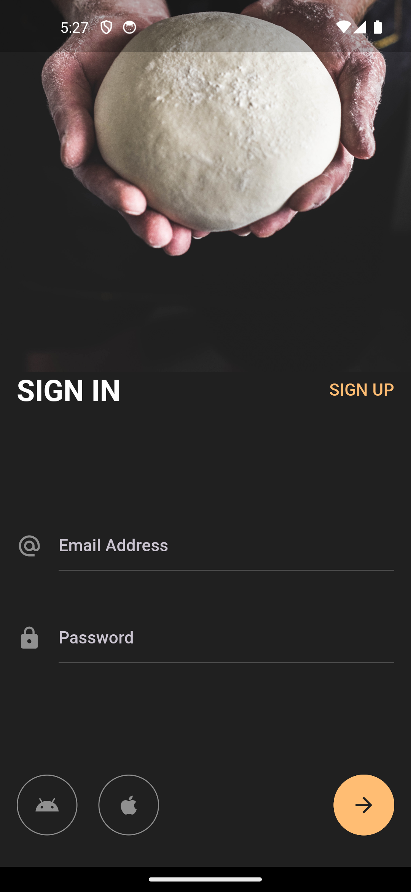

# Flutter App: Welcome Page and Sign-In UI

## Overview

This Flutter app features a Welcome Page and a Sign-In UI designed to provide users with a seamless and intuitive experience. The Welcome Page introduces the app to new users, while the Sign-In UI facilitates easy access for returning users.

## Features

### Welcome Page
- Brief introduction to your app's main features.
- Attractive and intuitive design to engage users.
- Navigation options to sign in or learn more about the app.

### Sign-In UI
- Secure user authentication using email and password.
- Options for social sign-in (e.g., Google, Apple)

## Screenshots

### Welcome Page


### Sign-In UI


## How to Use

1. **Welcome Page**:
   - Launch the app to view the Welcome Page.
   - Explore the features by clicking on 'START LEARNING'.

2. **Sign-In UI**:
   - Enter your email and password to sign in.
   - Use social sign-in options for quick access.

## Installation

1. Ensure you have [Flutter installed](https://flutter.dev/docs/get-started/install).
2. Clone this repository:
   ```bash
   git clone https://github.com/mobasaradev/beautiful_authentication_ui.git
